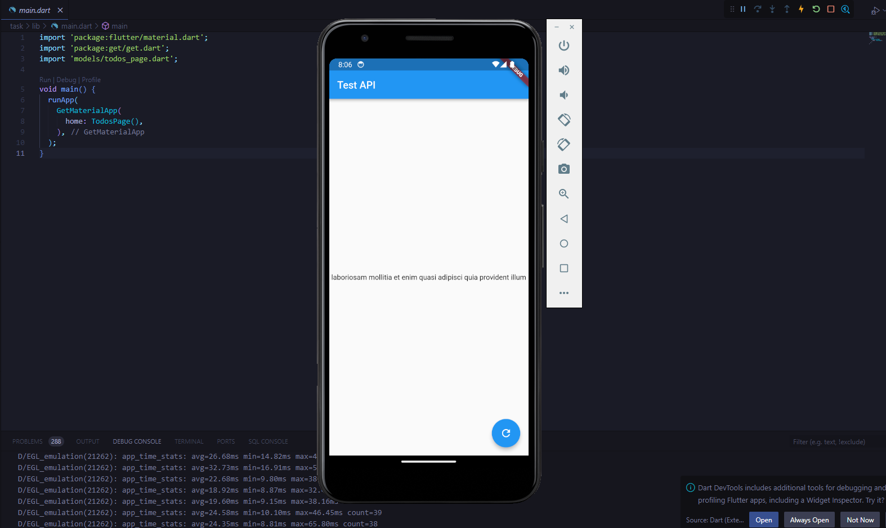

**Langkah A: Instalasi HTTP dan Webview**

1. Buka file `pubspec.yaml` dalam proyek Flutter.
2. Di bawah bagian `dependencies`, tambahkan dependensi untuk HTTP dan Webview:

```yaml
dependencies:
  flutter:
    sdk: flutter
  http: ^1.1.0
  webview_flutter: ^4.2.2
```

3. Simpan perubahan dan jalankan `flutter pub get` untuk mengunduh dependensi yang baru ditambahkan.
4. Jalankan proyek Flutter seperti biasa.

**Langkah B: Latihan HTTP**

1. Gunakan plugin HTTP untuk mengambil data dari internet, dalam contoh ini, API yang digunakan adalah https://jsonplaceholder.typicode.com/todos/5.

2. Untuk mengonversi data JSON menjadi model, dapat menggunakan aplikasi QuickType atau dapat secara manual membuat model yang sesuai berdasarkan struktur data JSON. Misalnya, berikut ini adalah model untuk endpoint tersebut:

```dart
class Todo {
  final int userId;
  final int id;
  final String title;
  final bool completed;

  Todo({
    required this.userId,
    required this.id,
    required this.title,
    required this.completed,
  });

  factory Todo.fromJson(Map<String, dynamic> json) {
    return Todo(
      userId: json['userId'],
      id: json['id'],
      title: json['title'],
      completed: json['completed'],
    );
  }
}
```

3. Buatlah sebuah class ApiService atau function yang akan digunakan untuk mengambil data dari API. Dalam contoh ini, membuat class `ApiService`:

```dart
class ApiService extends GetxController {
  RxBool isLoading = true.obs;
  RxString error = ''.obs;
  RxString title = ''.obs;

  Future<void> fetchTodos() async {
    isLoading(true);
    try {
      final response = await http.get(Uri.parse('https://jsonplaceholder.typicode.com/todos/5'));
      if (response.statusCode == 200) {
        final data = json.decode(response.body);
        title(data["title"]);
      } else {
        throw Exception('Failed to load data');
      }
    } catch (e) {
      error(e.toString());
    } finally {
      isLoading(false);
    }
  }
}
```

4. Buat User Interface (UI) untuk menampilkan data yang diambil dari API. Membuat tampilan UI sesuai dengan kebutuhan.

5. Perbarui kode `TodosPage` sesuai kebutuhan. Dapat mengganti nama class dan menyesuaikan tampilan UI dengan model `Todo` yang telah buat.

6. Menggunakan state management dengan GetX, perlu menambahkan dependensi GetX ke `pubspec.yaml` dan membuat controller untuk manajemen state. Perlu menghubungkan controller dengan tampilan UI.

Demikian langkah-langkah umum untuk mengambil data dari API menggunakan Flutter dengan HTTP, mengonversi data JSON menjadi model, dan menampilkannya dalam antarmuka pengguna. Dapat menyesuaikan langkah-langkah ini sesuai dengan proyek dan kebutuhan pengembangan.